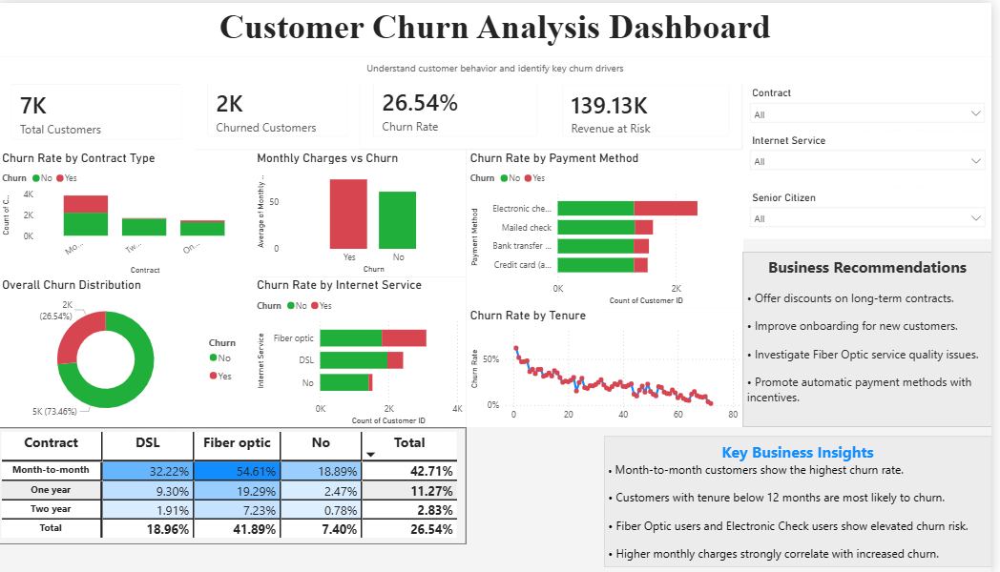

# 📊 Telecom Customer Churn Analysis

### Predicting Customer Attrition & Revenue Risk using Python, SQL, and Power BI

---

## 🚀 Project Overview

Customer churn is one of the biggest challenges faced by subscription-based businesses. Losing customers directly impacts revenue, profitability, and long-term growth.

This project analyzes customer churn behavior for a telecom company using data analytics techniques to identify:

- Why customers leave
- Which customer segments are most at risk
- How churn impacts business revenue
- What actions can improve customer retention

The analysis was performed on **7,043 customer records** containing demographic information, service subscriptions, contract details, payment methods, billing information, and churn status.

---

## 🎯 Business Objective

The telecom company was experiencing a customer churn rate of **26.54%**, resulting in significant revenue loss.

The primary objectives of this project were:

✔ Identify churn drivers

✔ Discover high-risk customer segments

✔ Quantify revenue at risk

✔ Develop actionable retention strategies

✔ Build an interactive executive dashboard

---

# 🛠 Tech Stack

| Category | Tools |
|----------|--------|
| Programming | Python |
| Data Analysis | Pandas, NumPy |
| Visualization | Matplotlib, Seaborn |
| Database Analysis | SQL |
| Dashboarding | Power BI |
| Environment | Jupyter Notebook |

---

# 📈 Dashboard Preview



---

# 📊 Executive Summary

| KPI | Value |
|------|--------|
| Total Customers | 7,043 |
| Churned Customers | 1,869 |
| Churn Rate | 26.54% |
| Revenue At Risk | $139.13K |

---

# 🔍 Key Insights

### 📌 Contract Type Drives Churn

Customers on **Month-to-Month contracts** exhibited the highest churn behavior.

| Contract Type | Churn Rate |
|--------------|-----------|
| Month-to-Month | ~43% |
| One Year | ~11% |
| Two Year | ~3% |

---

### 📌 New Customers Are Most Vulnerable

Customers with tenure below **12 months** showed significantly higher churn probability.

**Key Finding:** The first year is the most critical retention period.

---

### 📌 Payment Method Matters

Customers paying through **Electronic Check** demonstrated the highest churn behavior compared to other payment methods.

---

### 📌 Fiber Optic Customers Show Elevated Risk

Fiber Optic users consistently showed higher churn compared to DSL and customers without internet services.

---

### 📌 Revenue At Risk

Estimated revenue potentially lost due to churn:

# 💰 $139.13K

---

# 🎯 High-Risk Customer Segment

The highest-risk customers were identified as those with:

- Month-to-Month Contracts
- Tenure ≤ 12 Months
- Monthly Charges > $65

This segment showed approximately:

# ⚠️ 65% Churn Probability

---

# 🐍 Python Analysis

The following analytical tasks were performed:

### Data Preparation

- Data Cleaning
- Missing Value Checks
- Feature Exploration

### Exploratory Data Analysis

- Churn Distribution Analysis
- Contract Analysis
- Tenure Analysis
- Monthly Charges Analysis
- Internet Service Analysis
- Payment Method Analysis
- Correlation Analysis

### Libraries Used

```python
import pandas as pd
import numpy as np
import matplotlib.pyplot as plt
import seaborn as sns
```

---

# 🗄 SQL Analysis

Advanced SQL techniques were used to derive business insights.

### SQL Concepts Applied

- Aggregations
- CASE Statements
- Common Table Expressions (CTEs)
- Window Functions
- Cohort Analysis

### Key Analyses

- Overall Churn Rate
- Customer Segmentation
- Tenure Cohorts
- Revenue Analysis
- Risk Ranking
- High-Churn Customer Identification

---

# 📊 Power BI Dashboard

An interactive Power BI dashboard was developed to enable business users to explore churn trends and customer behavior.

### Dashboard Features

✅ KPI Cards

✅ Churn Distribution

✅ Contract Analysis

✅ Internet Service Analysis

✅ Payment Method Analysis

✅ Tenure-Based Churn Trends

✅ Business Recommendations

### Interactive Filters

- Contract Type
- Internet Service
- Senior Citizen

---

# 💡 Business Recommendations

### 1️⃣ Encourage Long-Term Contracts

Offer incentives to migrate Month-to-Month customers to annual plans.

### 2️⃣ Improve New Customer Onboarding

Focus retention efforts during the first 12 months.

### 3️⃣ Investigate Fiber Optic Service Issues

Analyze service quality and customer satisfaction metrics.

### 4️⃣ Promote Automatic Payments

Reduce churn by incentivizing digital payment methods.

### 5️⃣ Target High-Risk Customers

Launch proactive retention campaigns using churn-risk segmentation.

---

# 📂 Repository Structure

```text
Customer-Churn-Analysis/
│
├── CustomerChurn.csv
├── Customer_Churn_Analysis.ipynb
├── customer_churn_analysis.pbix
├── dashboard.png
└── README.md
```

---

# ▶️ How to Run

### Clone Repository

```bash
git clone https://github.com/AnanyaRaj-agr/Customer-Churn-Analysis.git
```

### Install Dependencies

```bash
pip install pandas numpy matplotlib seaborn
```

### Open Notebook

```text
Customer_Churn_Analysis.ipynb
```

### Open Power BI Dashboard

```text
customer_churn_analysis.pbix
```

using Microsoft Power BI Desktop.

---

# 🏆 Project Outcome

This project demonstrates practical skills in:

- Business Problem Solving
- Data Cleaning & Analysis
- Exploratory Data Analysis
- SQL-Based Analytics
- Dashboard Development
- Data Storytelling
- Business Intelligence

---

## 👩‍💻 Author

**Ananya Raj**

🔗 GitHub: https://github.com/AnanyaRaj-agr
